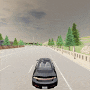

# carla-rl

[](https://opensource.org/licenses/MIT)

RL environments and trained agents in CARLA using RLlib

## Dependencies

* [CARLA](https://github.com/carla-simulator/carla): This project uses version 0.9.11
* [rllib-integration](https://github.com/carla-simulator/rllib-integration): The integration API is taken from here (with minor changes)

## Lane-follower

* Task: Follow the lane with given target speed. Episode ends if ego-vehicle changes the lane or stays idle for given number of steps or travells 200m.
* Observations: Camera image (grayscale), steering, throttle, speed, number of steps the vehicle has been idle
<p align='center'>
    
</p>

* Actions: Steer right/left, speed up/down
* Reward: If travelling at or below target speed, reward is same as distance travelled in the last step. If travelling above target speed, reward is zero. Reward of -1 if the ego-vehicle changes the lane or stays idle for given number of steps.
* After training for 350k timesteps, the agent behaves as follows:
<p align='center'>
    
</p>

* To train the agent,
```bash
python dqn_train.py dqn_example/dqn_config.yaml --name dqn --stop-timesteps 350000
```

* To run the included trained agent,
```bash
python dqn_inference_ray.py dqn_example/dqn_config.yaml _data/checkpoint_000170/checkpoint-170 --num-episodes 10
```
